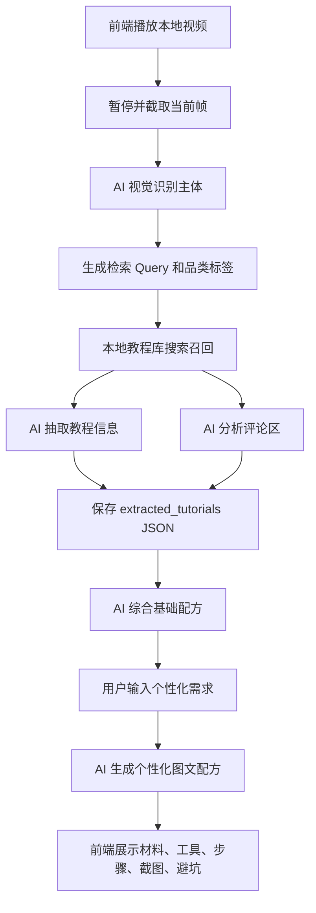

# 技术路径实现说明

## 1. 当前结论

项目现在的目标不是只做一个固定输出的演示页，而是要跑通一条真实 AI 能力参与的链路：

```text
播放本地真实视频
↓
用户暂停，截取当前帧
↓
AI 识别当前帧主体
↓
基于识别主体在本地数据集中搜索和召回对应教程
↓
AI 对召回教程及评论区做信息抽取
↓
将抽取结果、关键截图和评论洞察保存为结构化 JSON
↓
AI 综合同品类多个教程，生成基础配方
↓
用户输入个性化需求
↓
AI 结合基础配方和用户条件，生成个性化图文配方
```

这条路径是正确的。重点是：AI 不只负责最后生成配方，还要真实参与主体识别、搜索召回、信息抽取、评论洞察、基础教程综合和个性化改写。

MVP 仍然保留固定兜底，但兜底只用于现场稳定，不作为主技术路线。

## 2. 总体架构



## 3. 数据准备

本地数据仍然是项目可信度的基础。需要先把你准备的视频素材整理成统一索引：

```text
data/
  videos.json
  comments.json
  generated/
    vision_manifest.json
    extracted_tutorials.json
    base_recipes.json
    personalized_recipes.json
public/
  images/
    视频封面和关键步骤截图
甜品视频/
  本地真实抖音视频
```

`data/videos.json` 是主索引，每条视频至少包含：

```json
{
  "video_id": "puff_01",
  "category": "泡芙",
  "category_key": "puff",
  "title": "真实视频标题",
  "author": "作者名",
  "source_video": "甜品视频/example.mp4",
  "cover_image": "public/images/example_cover.png",
  "transcript": "字幕或口播摘要",
  "description": "视频描述",
  "ingredients": [],
  "tools": [],
  "steps": [],
  "stats": {
    "likes": 120000,
    "favorites": 34000,
    "comments": 2100
  }
}
```

如果某些字段还没有人工整理，可以先为空，但 `video_id`、`source_video`、`category_key`、`title`、`cover_image` 要尽量补齐，否则检索召回和前端展示会不稳定。

## 4. 暂停帧主体识别

前端在用户暂停视频时，从当前 `<video>` 元素截取一帧，转成 base64，调用：

```http
POST /api/identify
```

输入：

```json
{
  "video_id": "puff_01",
  "image_base64": "当前暂停帧",
  "title": "视频标题",
  "ocr_text": "可选 OCR 文本",
  "frame_caption": "可选帧描述"
}
```

后端优先用 `scripts/ai_client.py` 中的 `vision_identify()` 调用视觉模型识别当前帧主体，输出：

```json
{
  "dish_name": "泡芙",
  "category_key": "puff",
  "confidence": 0.92,
  "reason": "画面中有圆形空心泡芙和奶油夹馅",
  "source": "vision_ai"
}
```

识别规则：

- 如果视觉模型识别结果能匹配 `data/category_aliases.json`，使用 AI 识别结果。
- 如果 AI 识别失败，再用 `video_id` 的本地人工标注兜底。
- 如果本地标注为空，再用标题、字幕、OCR 文本做别名匹配。
- 不允许因为空 `category_key` 导致接口 500，识别失败也必须返回稳定 JSON。

## 5. 搜索召回

搜索召回是当前阶段的技术重点。目标是：根据暂停帧识别出的主体，从你准备的本地视频数据中找到对应教程，而不是写死某几个案例。

### 5.1 MVP 搜索方案

当前数据量不大，可以先采用 AI + 结构化检索混合方案：

```text
识别结果：dish_name=泡芙，category_key=puff
↓
候选池：读取 data/videos.json
↓
粗召回：category_key / 标题 / 描述 / OCR / transcript 命中
↓
AI 重排：让模型判断哪些视频最像“泡芙教程”
↓
返回 top_k 教程，例如 3 条泡芙教程
```

召回结果结构：

```json
{
  "query": {
    "dish_name": "泡芙",
    "category_key": "puff",
    "source_video_id": "puff_01"
  },
  "retrieved_tutorials": [
    {
      "video_id": "puff_01",
      "title": "泡芙教程 01",
      "category_key": "puff",
      "score": 0.96,
      "reason": "标题、人工标签和画面主体都匹配泡芙",
      "source_video": "甜品视频/example.mp4",
      "cover_image": "public/images/example_cover.png"
    }
  ]
}
```

### 5.2 后续增强搜索方案

数据量增加后再升级为：

```text
品类标签过滤
↓
标题、字幕、OCR 文本向量检索
↓
关键帧视觉相似度检索
↓
评论质量、教程完整度、互动数据重排
↓
AI rerank 给出最终召回结果和理由
```

但黑客松当前阶段不需要先搭复杂向量库，可以先让 AI 对候选教程做语义判断和重排。

## 6. 教程与评论信息抽取

召回到同品类教程后，需要对每条视频及评论区做结构化抽取。这个步骤应该真实调用 AI，而不是只靠手写模板。

输入包括：

- 视频标题
- 视频描述
- 字幕或口播摘要
- OCR 文本
- 已有人工整理的材料、步骤、工具
- 关键帧截图路径
- 评论区文本、点赞数、标签

输出保存到：

```text
data/generated/extracted_tutorials.json
```

单条教程抽取结构：

```json
{
  "video_id": "puff_01",
  "category_key": "puff",
  "dish_name": "泡芙",
  "ingredients": [
    {"name": "低筋面粉", "amount": "60g", "note": "用于泡芙外壳"}
  ],
  "tools": [
    {"name": "奶锅", "note": "用于烫面"},
    {"name": "烤箱", "note": "用于高温定型和烤干"}
  ],
  "flavors": ["原味", "奶香"],
  "steps": [
    {
      "step": 1,
      "title": "煮沸液体",
      "action": "将水、黄油、糖、盐加热到沸腾。",
      "key_state": "黄油完全融化，液体持续冒泡。",
      "time": "2-3 分钟",
      "temperature": "",
      "image": "public/images/puff_01_step_01.png",
      "risk": "液体没有沸腾会导致面粉糊化不足。"
    }
  ],
  "comment_insights": {
    "success_points": ["蛋液分次加入更容易成功"],
    "failure_patterns": [
      {
        "problem": "出炉塌陷",
        "reason": "烘烤不足或中途开门",
        "solution": "前段不要开门，外壳烤干后再取出"
      }
    ],
    "substitutions": [
      {"need": "没有裱花袋", "suggestion": "用厚保鲜袋剪小口"}
    ],
    "faq": []
  },
  "evidence": {
    "screenshots": ["public/images/puff_01_step_01.png"],
    "comment_ids": ["puff_01_c001", "puff_01_c002"]
  }
}
```

注意：

- AI 可以从素材里抽取信息，但不能编造不存在的精确克重、温度和时间。
- 如果多个来源冲突，保留范围或写“按状态判断”。
- 必要截图要存储为路径，前端只渲染路径，不直接依赖模型生成图片。

## 7. 基础配方综合

以泡芙为例，召回 3 个泡芙教程后，AI 需要综合它们的抽取结果，生成基础配方。

输入：

```json
{
  "category_key": "puff",
  "dish_name": "泡芙",
  "tutorials": ["3 个泡芙教程的 extracted_tutorials"],
  "comment_insights": ["对应评论区洞察"]
}
```

输出保存到：

```text
data/generated/base_recipes.json
```

基础配方结构：

```json
{
  "category_key": "puff",
  "dish_name": "泡芙",
  "title": "基础泡芙配方",
  "serving": "约 8-10 个小泡芙",
  "difficulty": "中等，新手可做但需要看状态",
  "base_flavor": ["原味", "奶香", "可夹奶油"],
  "ingredients": [
    {"name": "低筋面粉", "amount": "55-60g", "note": "多个教程用量接近"},
    {"name": "黄油", "amount": "40-45g", "note": "提供香气和支撑"},
    {"name": "鸡蛋", "amount": "约 90-110g", "note": "分次加入，以倒三角状态为准"}
  ],
  "tools": ["奶锅", "硅胶刮刀", "打蛋盆", "裱花袋", "烤箱"],
  "steps": [
    {
      "step": 1,
      "title": "煮沸液体",
      "action": "将水或牛奶、黄油、糖和盐加热到完全沸腾。",
      "key_state": "黄油完全融化，液体持续冒泡。",
      "time": "2-3 分钟",
      "image": "public/images/puff_01_step_01.png",
      "risk": "液体没沸腾就加粉，面糊糊化不足。"
    }
  ],
  "common_pitfalls": [
    {
      "problem": "出炉塌陷",
      "reason": "烘烤不足、中途开门或外壳没烤干",
      "solution": "前段不要开门，烤到外壳干硬后再取出。"
    }
  ],
  "faq": [],
  "evidence_videos": ["puff_01", "puff_02", "puff_03"]
}
```

基础配方不是个性化配方。它只负责回答：综合多个教程后，最稳、最基础的做法是什么。

## 8. 个性化配方生成

用户输入个性化需求后，再调用 AI 基于基础配方做适配。

输入：

```json
{
  "base_recipe": "基础配方 JSON",
  "user_requirement": "我想少糖，用空气炸锅，没有裱花袋，新手。",
  "retrieved_tutorials": "召回教程摘要",
  "comment_insights": "评论区洞察"
}
```

输出：

```json
{
  "title": "少糖空气炸锅版泡芙",
  "summary": "根据你的需求，降低夹馅糖量，并将烤箱流程调整为空气炸锅小批量烘烤。",
  "adjustments": [
    "糖量降低约 30%，优先减少夹馅糖量",
    "裱花袋替换为厚保鲜袋剪口",
    "烤箱流程改为空气炸锅分批烤",
    "步骤增加倒三角、外壳烤干等新手状态判断"
  ],
  "ingredients": [],
  "tools": [],
  "steps": [],
  "pitfalls": [],
  "faq": [],
  "evidence_videos": ["puff_01", "puff_02", "puff_03"]
}
```

个性化生成要求：

- 必须体现用户输入，不能只换标题。
- 如果用户要求会降低成功率，要明确提示风险。
- 不能删除关键工艺步骤，比如泡芙的烫面、分次加蛋液、高温定型。
- 温度和时间不确定时，用范围和状态判断表达。
- 输出必须是前端可直接渲染的 JSON。

## 9. API 设计

后端需要围绕真实链路提供接口：

| 方法 | 路径 | 用途 |
| --- | --- | --- |
| `GET` | `/api/videos` | 返回本地视频索引 |
| `GET` | `/api/current-video` | 返回当前演示视频 |
| `GET` | `/api/videos/:id` | 返回单个视频 |
| `POST` | `/api/identify` | 识别暂停帧主体 |
| `POST` | `/api/retrieve` | 根据识别主体搜索召回教程 |
| `POST` | `/api/extract` | 对召回教程和评论做 AI 抽取 |
| `POST` | `/api/analyze` | 可组合 retrieve + extract + base recipe |
| `POST` | `/api/generate-recipe` | 根据基础配方和用户需求生成个性化配方 |

MVP 前端可以只调用：

```text
/api/identify
/api/analyze
/api/generate-recipe
```

但后端内部代码应拆成：

```text
identify_subject_with_ai()
retrieve_tutorials_with_ai()
extract_tutorials_with_ai()
synthesize_base_recipe_with_ai()
personalize_recipe_with_ai()
```

这样既能演示完整链路，也方便后续扩展独立 Agent。

## 10. AI 接入配置

当前项目实际接入的是 OpenRouter，配置来自 `.env.local` 或环境变量：

```bash
export OPENROUTER_API_KEY="你的 API Key"
export OPENROUTER_MODEL="meta-llama/llama-4-scout"
export OPENROUTER_VISION_MODEL="meta-llama/llama-4-scout"
export OPENROUTER_TIMEOUT="30"
```

当前可用入口：

- `scripts/ai_client.py::vision_identify()`：用于暂停帧视觉识别。
- `scripts/ai_client.py::responses_json()`：用于检索重排、教程抽取、评论洞察、基础配方综合、个性化配方生成。

如果没有设置 `OPENROUTER_API_KEY`，系统可以返回固定兜底结果；但正式技术路线应优先调用已接入 AI。

## 11. 实施顺序

### 第一阶段：真实 AI 主链路跑通

目标：先用一个品类，例如泡芙，跑通真实链路。

1. 整理 `data/videos.json`，确保泡芙 3 个教程都有统一 `category_key`、视频路径、封面、必要截图和评论关联。
2. 前端暂停视频后截帧，调用 `/api/identify`。
3. 后端用视觉模型识别当前帧主体。
4. 后端根据识别结果调用 AI 做本地教程搜索和重排。
5. 对召回的泡芙教程和评论区调用 AI 抽取，保存 `data/generated/extracted_tutorials.json`。
6. AI 综合 3 个泡芙教程，生成并保存基础配方。
7. 用户输入需求后，AI 生成个性化配方。
8. 前端展示图文步骤、材料、工具、截图、评论区避坑。

### 第二阶段：稳定性和缓存

1. 每一步 AI 输出都保存 JSON 缓存。
2. 同一个视频和同一个需求重复运行时，优先读取缓存，避免现场反复等待。
3. AI 失败时读取最近一次成功缓存。
4. 缓存不存在时再使用规则兜底。

### 第三阶段：多品类扩展

1. 将泡芙链路复制到巴斯克、雪媚娘。
2. 补充每个品类的关键截图、评论和基础配方缓存。
3. 搜索召回从品类过滤升级为语义重排。
4. 结果页展示当前配方的证据视频和评论来源。

## 12. 验收标准

技术验收：

- 暂停视频后，真实调用 AI 识别当前帧主体。
- 识别结果能触发本地教程搜索召回。
- 召回结果不是写死，而是基于 `data/videos.json` 候选数据和 AI 重排。
- AI 能对召回视频及评论区输出结构化 JSON。
- 基础配方来自多个同品类教程的综合，而不是单条视频摘要。
- 个性化配方明确响应用户条件。
- 前端、后端、AI 输出字段一致。
- 模型失败时有缓存或兜底，不中断演示。

产品验收：

- 评委能看到“暂停识别”的入口价值。
- 评委能看到“搜索到了哪些对应教程”。
- 评委能看到“评论区经验进入了避坑提示”。
- 评委能看到“基础配方”和“个性化配方”是两步，而不是一次聊天生成。
- 最终结果像厨房操作手册，不是普通文本回答。
